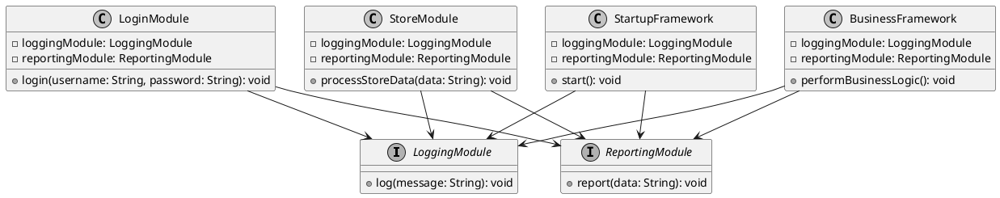

Facade 模式在软件开发中被广泛应用

"Facade"模式是一种结构型设计模式，它提供了一个简化的接口，用于访问复杂系统的子系统或类集合。这种模式的目的是隐藏底层系统的复杂性，为客户端提供一个简单的接口，以便使用系统的功能。

以下是一些常见的使用 Facade 模式的情况：

- 第三方库或框架的包装：当使用第三方库或框架时，可以使用 Facade 模式创建一个简单的接口，以隐藏复杂的库或框架调用和配置。这样可以简化客户端代码，提供更易用和更高层次的抽象。

- 子系统的简化访问：如果一个系统包含多个子系统，每个子系统都有一系列的接口和方法，可以使用 Facade 模式创建一个统一的接口，封装对子系统的访问。这样客户端只需要和 Facade 接口进行交互，而无需了解子系统的复杂性。

- 对外部系统的访问：当需要与外部系统进行交互时，可以使用 Facade 模式创建一个简化的接口，隐藏与外部系统的通信细节。这样可以降低与外部系统的耦合度，并提供更灵活和可维护的代码。

- 简化复杂接口：当一个接口过于庞大或复杂时，可以使用 Facade 模式创建一个简化的接口，将复杂的操作和功能进行封装。这样可以提供一个更易用和清晰的接口，减少客户端的学习成本和开发难度。

总的来说，Facade 模式在任何需要简化接口、封装复杂性、提供高层次抽象的情况下都可以发挥作用。它有助于减少系统的耦合度，提供更好的代码组织和易用性。

